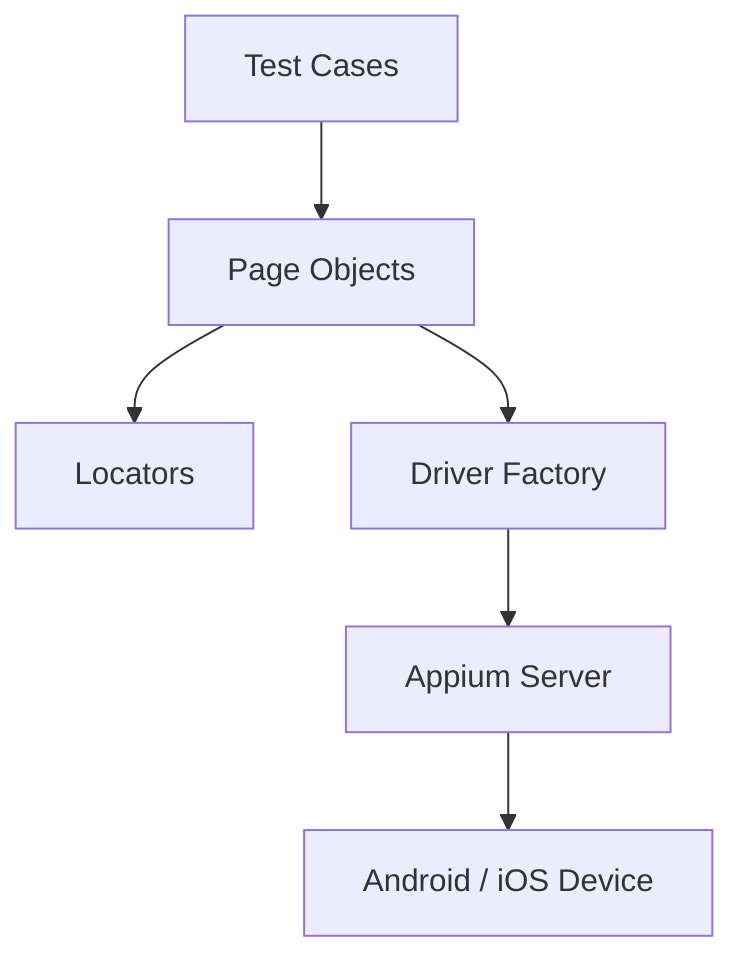
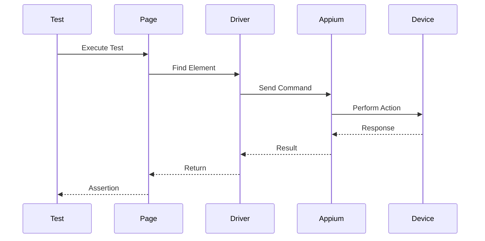

<div align="center">

# 📱 Selenium Python Mobile Automation Framework

### Cross-Platform Mobile Automation Testing using Appium 2, Pytest & Python

[](https://www.python.org/)
[](https://pytest.org/)
[](https://appium.io/)
[]()
[]()

A scalable and maintainable mobile automation testing framework built with **Python**, **Pytest**, **Appium 2**, and the **Page Object Model (POM)** design pattern.

</div>

---

# 📖 Table of Contents

- [Overview](#-overview)
- [Features](#-features)
- [Project Structure](#-project-structure)
- [Architecture](#-architecture)
- [Technology Stack](#-technology-stack)
- [Installation](#-installation)
- [Prerequisites](#-prerequisites)
- [Running Tests](#-running-tests)
- [Reports](#-reports)
- [Design Pattern](#-design-pattern)
- [Future Improvements](#-future-improvements)
- [Author](#-author)

---

# 🚀 Overview

This project is a cross-platform mobile automation testing framework for Android and iOS applications.

The framework is built with scalability, maintainability, and code reusability in mind by implementing the **Page Object Model (POM)** design pattern.

It supports Android Emulator, Android Real Device, iOS Simulator, and iOS Real Device (with appropriate configuration).

---

# ✨ Features

- ✅ Android Automation Testing
- ✅ iOS Automation Testing
- ✅ Appium 2
- ✅ Pytest
- ✅ Page Object Model (POM)
- ✅ JSON Test Data
- ✅ Screenshot on Failure
- ✅ HTML Report
- ✅ JSON Report
- ✅ Cross Platform Structure
- ✅ Driver Factory
- ✅ Reusable Components
- ✅ Easy Configuration

---

# 📂 Project Structure

```text
SELENIUM-PYTHON-MOBILE
│
├── apps/
│   ├── android/
│   └── ios/
│
├── config/
│
├── drivers/
│
├── locators/
│
├── pages/
│
├── reports/
│   ├── html/
│   ├── json/
│   └── screenshots/
│
├── test_data/
│
├── tests/
│   ├── android/
│   └── ios/
│
├── utils/
│
├── conftest.py
├── pytest.ini
├── requirements.txt
└── README.md
```

---

# 🏗 Architecture



---

# 📱 Test Flow



---

# 🛠 Technology Stack

| Category | Technology |
|----------|------------|
| Language | Python 3.12 |
| Framework | Pytest |
| Mobile Automation | Appium 2 |
| Pattern | Page Object Model |
| Platform | Android & iOS |
| Reporting | pytest-html |
| Test Data | JSON |

---

# 📦 Installation

Clone repository

```bash
git clone https://github.com/naufalazhar65/SELENIUM-PYTHON-MOBILE.git
```

Go to project

```bash
cd SELENIUM-PYTHON-MOBILE
```

Create virtual environment

```bash
python3 -m venv .venv
```

Activate

macOS / Linux

```bash
source .venv/bin/activate
```

Windows

```bash
.venv\Scripts\activate
```

Install dependencies

```bash
pip install -r requirements.txt
```

---

# ⚙ Prerequisites

Install Appium

```bash
npm install -g appium
```

Install Android Driver

```bash
appium driver install uiautomator2
```

Install iOS Driver

```bash
appium driver install xcuitest
```

Verify

```bash
appium driver list
```

Start Appium

```bash
appium server
```

---

# ▶ Running Tests

Android

```bash
pytest tests/android
```

iOS

```bash
pytest tests/ios
```

Specific Test

```bash
pytest tests/android/test_login.py
```

Specific Test Method

```bash
pytest tests/android/test_login.py::TestLogin::test_success_login
```

---

# 📊 Reports

Generate HTML Report

```bash
pytest --html=reports/html/report.html
```

Generate JSON Report

```bash
pytest --json-report --json-report-file=reports/json/output.json
```

Report Structure

```text
reports/
├── html/
├── json/
└── screenshots/
```

---

# 📸 Screenshot on Failure

Whenever a test fails, a screenshot is automatically captured.

```text
reports/screenshots/
```

---

# 📖 Design Pattern

The framework implements the **Page Object Model (POM)**.

```text
Tests
    │
    ▼
Pages
    │
    ▼
Locators
    │
    ▼
Driver Factory
```

### Benefits

- Better Maintainability
- High Reusability
- Easy Debugging
- Clean Test Scripts
- Scalable Framework

---

# 🚀 Future Improvements

- GitHub Actions
- Allure Report
- Docker
- Jenkins
- BrowserStack
- Sauce Labs
- Parallel Execution
- Slack Notification
- Telegram Notification

---

# 👨‍💻 Author

**Naufal Azhar**

Software Quality Assurance Engineer

- GitHub: https://github.com/naufalazhar65
- LinkedIn: https://linkedin.com/in/naufalazhar

---

<div align="center">

### ⭐ If you find this project useful, don't forget to give it a star!

</div>