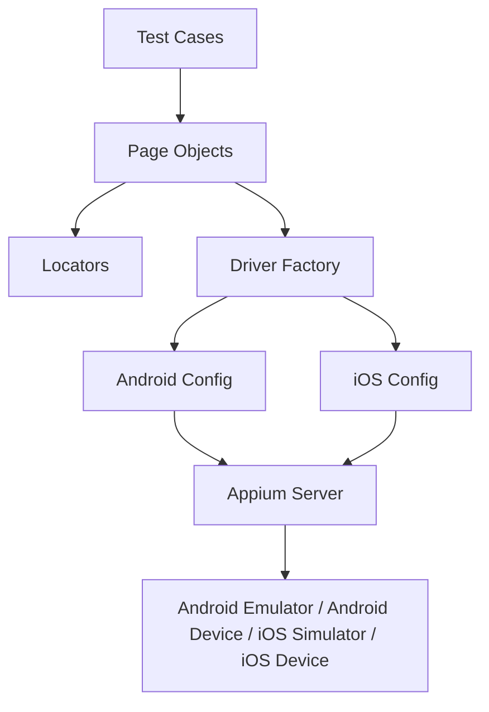
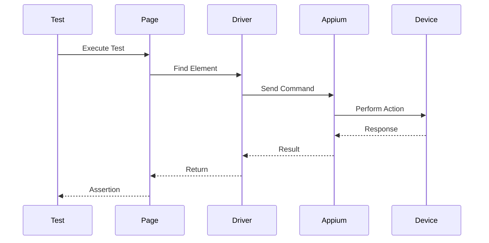

<div align="center">

# 📱 Selenium Python Mobile Automation Framework

### Cross-Platform Mobile Automation Testing using Appium 2, Pytest & Python

[](https://www.python.org/)
[](https://pytest.org/)
[](https://appium.io/)
[]()
[]()

A scalable and maintainable cross-platform mobile automation testing framework built with **Python**, **Pytest**, **Appium 2**, and the **Page Object Model (POM)** design pattern.

</div>

---

# 📖 Table of Contents

- [Overview](#-overview)
- [Features](#-features)
- [Supported Platforms](#-supported-platforms)
- [Project Structure](#-project-structure)
- [Architecture](#-architecture)
- [Technology Stack](#-technology-stack)
- [Installation](#-installation)
- [Prerequisites](#-prerequisites)
- [Test Applications](#-test-applications)
- [Configuration](#-configuration)
- [Running Tests](#-running-tests)
- [Reports](#-reports)
- [Screenshot on Failure](#-screenshot-on-failure)
- [Design Pattern](#-design-pattern)
- [Future Improvements](#-future-improvements)
- [Author](#-author)

---

# 🚀 Overview

This project is a cross-platform mobile automation testing framework for Android and iOS applications.

The framework is designed with scalability, maintainability, and code reusability in mind by implementing the **Page Object Model (POM)** design pattern.

It supports Android Emulator, Android Real Device, iOS Simulator, and iOS Real Device (with appropriate configuration).

---

- ✅ Android Automation Testing
- ✅ iOS Automation Testing
- ✅ Appium 2
- ✅ Pytest
- ✅ Page Object Model (POM)
- ✅ Driver Factory
- ✅ Platform-based Configuration
- ✅ Platform-specific Page Objects
- ✅ Platform-specific Locators
- ✅ JSON Test Data
- ✅ Screenshot on Failure
- ✅ HTML Report
- ✅ JSON Report
- ✅ Cross Platform Architecture
- ✅ Reusable Components

---

# 📱 Supported Platforms

| Platform            | Status                               |
| ------------------- | ------------------------------------ |
| Android Emulator    | ✅                                   |
| Android Real Device | ✅                                   |
| iOS Simulator       | ✅                                   |
| iOS Real Device     | ✅ (with valid provisioning profile) |

---

# 📂 Project Structure

```text
SELENIUM-PYTHON-MOBILE
│
├── apps/
│   └── MyDemoAppRN.apk
│
├── config/
│   ├── android_config.py
│   └── ios_config.py
│
├── drivers/
│   └── driver_factory.py
│
├── locators/
│   ├── android/
│   └── ios/
│
├── pages/
│   ├── android/
│   └── ios/
│
├── reports/
│   ├── html/
│   ├── json/
│   └── screenshots/
│
├── test_data/
│
├── tests/
│   ├── android/
│   │   └── test_android_login.py
│   │
│   └── ios/
│       ├── test_ios_login.py
│       └── test_ios_products.py
│
├── utils/
│
├── conftest.py
├── pytest.ini
├── requirements.txt
└── README.md
```

# 🏗 Architecture



---

# 📱 Test Flow



---

# 🛠 Technology Stack

| Category          | Technology              |
| ----------------- | ----------------------- |
| Language          | Python 3.12             |
| Framework         | Pytest                  |
| Mobile Automation | Appium 2                |
| Pattern           | Page Object Model (POM) |
| Platform          | Android & iOS           |
| Reporting         | pytest-html             |
| Test Data         | JSON                    |

---

# 📦 Installation

Clone the repository

```bash
git clone https://github.com/naufalazhar65/SELENIUM-PYTHON-MOBILE.git
```

Navigate to the project directory

```bash
cd SELENIUM-PYTHON-MOBILE
```

Create a virtual environment

```bash
python3 -m venv .venv
```

Activate the virtual environment

### macOS / Linux

```bash
source .venv/bin/activate
```

### Windows

```bash
.venv\Scripts\activate
```

Install project dependencies

```bash
pip install -r requirements.txt
```

---

# ⚙ Prerequisites

Install Appium

```bash
npm install -g appium
```

Install Android Driver

```bash
appium driver install uiautomator2
```

Install iOS Driver

```bash
appium driver install xcuitest
```

Verify installed drivers

```bash
appium driver list
```

Start the Appium server

```bash
appium server
```

---

# 📱 Test Applications

## Android

Android automation uses the APK included in this repository.

```text
apps/
└── MyDemoAppRN.apk
```

## iOS

The iOS application is installed through **Xcode** and launched using its **Bundle ID**.

```python
options.set_capability(
    "bundleId",
    "com.saucelabs.mydemo.app.ios"
)
```

> **Note**
>
> The original iOS demo application package is no longer compatible with the latest iOS versions. Therefore, the application is installed via Xcode and launched using its Bundle ID.

---

---

# ⚙ Configuration

## Android

Android automation launches the application directly from the APK stored in the project.

```text
apps/
└── MyDemoAppRN.apk
```

Configuration is located in:

```text
config/android_config.py
```

---

## iOS

iOS automation uses an application already installed on the iOS Simulator or a real device.

Instead of providing an `.app` file, Appium launches the application using its **Bundle ID**.

Example:

```python
options.set_capability("bundleId", "com.saucelabs.mydemo.app.ios")
```

Configuration is located in:

```text
config/ios_config.py
```

> **Note**
>
> The iOS application is not included in this repository. It must be installed on the simulator or device before running the tests.

---

# ▶ Running Tests

Run all Android tests

```bash
pytest tests/android
```

Run all iOS tests

```bash
pytest tests/ios
```

Run tests by marker

Android

```bash
pytest -m android
```

iOS

```bash
pytest -m ios
```

Run a specific test file

```bash
pytest tests/android/test_android_login.py
```

Run a specific test case

```bash
pytest tests/android/test_android_login.py::TestLogin::test_success_login
```

---

# 📊 Reports

Generate HTML Report

```bash
pytest --html=reports/html/report.html
```

Generate JSON Report

```bash
pytest --json-report --json-report-file=reports/json/output.json
```

Report directory

```text
reports/
├── html/
├── json/
└── screenshots/
```

---

# 📸 Screenshot on Failure

Whenever a test fails, a screenshot is automatically captured and stored in:

```text
reports/screenshots/
```

---

# 📖 Design Pattern

This framework implements the **Page Object Model (POM)** to improve maintainability and code reusability.

```text
Tests
   │
   ▼
Pages
   │
   ▼
Locators
   │
   ▼
Driver Factory
   │
   ▼
Platform Configuration
   │
   ▼
Appium Server
   │
   ▼
Android / iOS Device
```

## Benefits

- Better Maintainability
- High Reusability
- Easy Debugging
- Clean Test Scripts
- Scalable Framework
- Platform Separation
- Centralized Driver Management

---

# 🚀 Future Improvements

- GitHub Actions CI/CD
- Parallel Test Execution
- Allure Report
- Docker Support
- BrowserStack Integration
- Sauce Labs Integration
- Jenkins Pipeline
- Environment Configuration (.env)
- YAML-based Device Configuration
- Logging Enhancement
- Slack Notification
- Telegram Notification

---

# 👨‍💻 Author

**Naufal Azhar**

Software Quality Assurance Engineer

- GitHub: https://github.com/naufalazhar65
- LinkedIn: https://linkedin.com/in/naufalazhar

---

<div align="center">

### ⭐ If you find this project useful, don't forget to give it a star!

</div>
