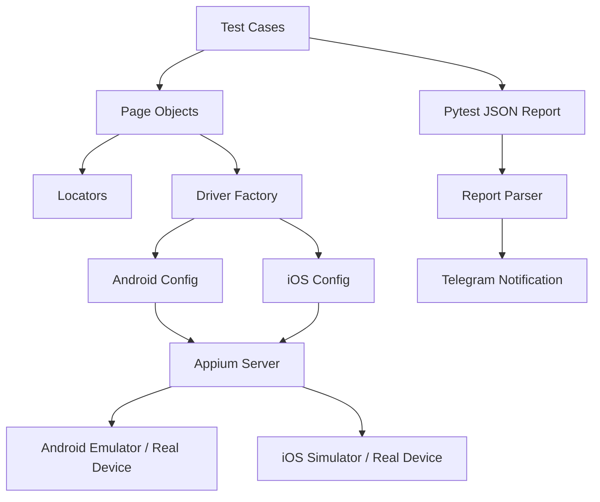
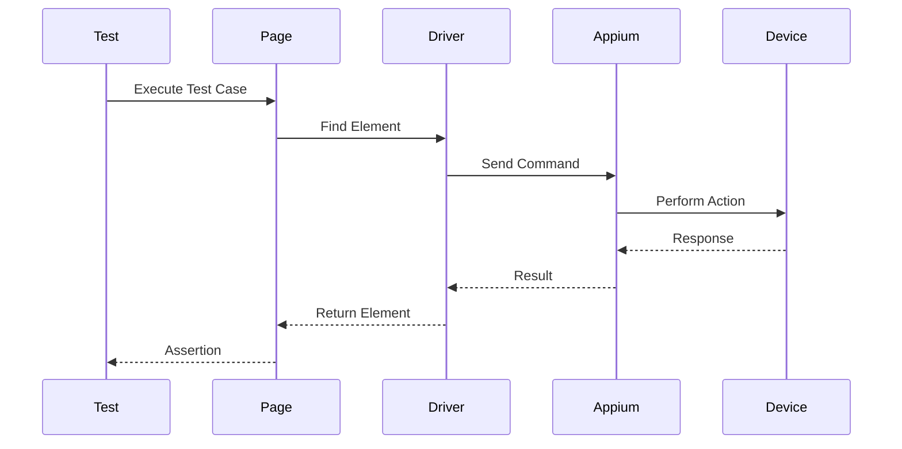
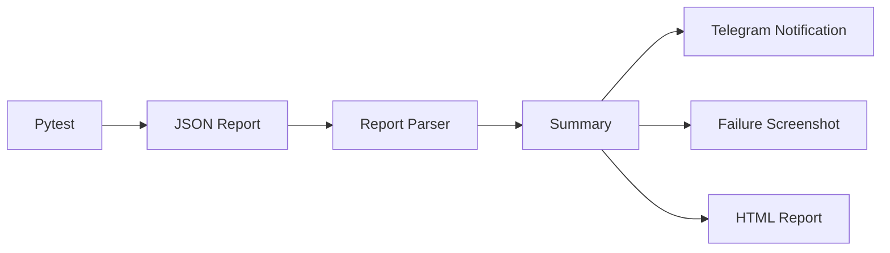
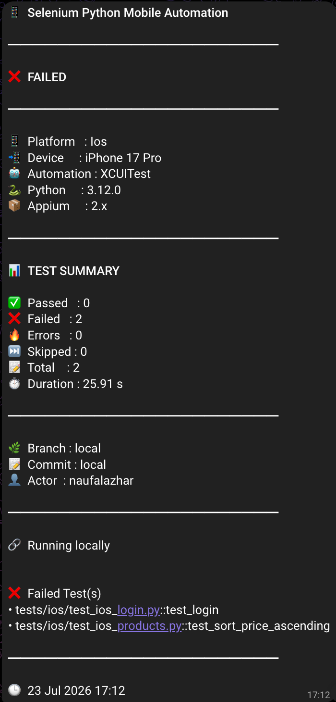

<div align="center">

# 📱 Selenium Python Mobile Automation Framework

### Cross-Platform Mobile Automation Testing using Python, Pytest & Appium 2

<p align="center">

[](https://www.python.org/)
[](https://pytest.org/)
[](https://appium.io/)
[]()
[]()

</p>

A scalable and maintainable **cross-platform mobile automation testing framework** built with **Python**, **Pytest**, and **Appium 2** following the **Page Object Model (POM)** architecture.

Designed to support both **Android** and **iOS** automation testing with reusable components, centralized driver management, reporting, screenshots, and Telegram notifications.

</div>

---

# 📖 Table of Contents

- [Overview](#-overview)
- [Features](#-features)
- [Supported Platforms](#-supported-platforms)
- [Project Structure](#-project-structure)
- [Architecture](#-architecture)
- [Technology Stack](#-technology-stack)
- [Installation](#-installation)
- [Prerequisites](#️-prerequisites)
- [Configuration](#️-configuration)
- [Running Tests](#️-running-tests)
- [Reporting](#-reporting)
- [Telegram Notification](#-telegram-notification)
- [Screenshot on Failure](#-screenshot-on-failure)
- [Design Pattern](#-design-pattern)
- [Roadmap](#-roadmap)
- [Author](#-author)

---

# 🚀 Overview

This project is a **cross-platform mobile automation testing framework** developed using **Python**, **Pytest**, and **Appium 2**.

The framework follows the **Page Object Model (POM)** design pattern to ensure scalability, maintainability, and code reusability for both Android and iOS automation testing.

Currently, the framework supports:

- Android Emulator
- Android Real Device
- iOS Simulator
- iOS Real Device (with proper provisioning)

Besides executing automated test cases, the framework also provides:

- HTML Test Report
- JSON Test Report
- Automatic Screenshot Capture on Failure
- Telegram Test Summary Notification
- Platform-based Driver Factory
- Reusable Utilities
- Platform-specific Page Objects
- Platform-specific Locators

This repository is intended as a production-style automation framework that can easily be extended with CI/CD pipelines, cloud device providers, and parallel execution.

---

# ✨ Features

### 📱 Mobile Automation

- ✅ Android Automation Testing
- ✅ iOS Automation Testing
- ✅ Android Emulator Support
- ✅ Android Real Device Support
- ✅ iOS Simulator Support
- ✅ iOS Real Device Support

---

### ⚙️ Automation Framework

- ✅ Python 3.12
- ✅ Pytest Framework
- ✅ Appium 2
- ✅ Page Object Model (POM)
- ✅ Driver Factory Pattern
- ✅ Platform-based Configuration
- ✅ Platform-specific Page Objects
- ✅ Platform-specific Locators
- ✅ Reusable Utility Functions
- ✅ JSON Test Data
- ✅ Custom Pytest Configuration

---

### 📊 Reporting

- ✅ HTML Report
- ✅ JSON Report
- ✅ Automatic Screenshot on Failure
- ✅ Test Summary Generator
- ✅ Failed Test Detection
- ✅ Execution Duration Summary

---

### 📨 Notifications

- ✅ Telegram Test Notification
- ✅ Telegram Failure Screenshot
- ✅ Local Execution Summary
- ✅ GitHub Actions Context Support

---

### 🧩 Project Architecture

- ✅ Clean Project Structure
- ✅ Modular Components
- ✅ Cross-platform Design
- ✅ Easy Maintenance
- ✅ Scalable Framework
- ✅ Easy Extension for New Test Cases

---

# 📱 Supported Platforms

| Platform            | Status                                       |
| ------------------- | -------------------------------------------- |
| Android Emulator    | ✅ Supported                                 |
| Android Real Device | ✅ Supported                                 |
| iOS Simulator       | ✅ Supported                                 |
| iOS Real Device     | ✅ Supported (Requires Provisioning Profile) |

---

# 📂 Project Structure

```text
SELENIUM-PYTHON-MOBILE
│
├── apps/
│   └── MyDemoAppRN.apk
│
├── config/
│   ├── android_config.py
│   └── ios_config.py
│
├── drivers/
│   └── driver_factory.py
│
├── locators/
│   ├── android/
│   └── ios/
│
├── pages/
│   ├── android/
│   └── ios/
│
├── reports/
│   ├── html/
│   ├── json/
│   └── screenshots/
│
├── scripts/
│   └── send_report.py
│
├── test_data/
│
├── tests/
│   ├── android/
│   └── ios/
│
├── utils/
│   ├── github_context.py
│   ├── report_parser.py
│   ├── report_sender.py
│   ├── screenshot.py
│   ├── telegram_notifier.py
│   └── wait.py
│
├── conftest.py
├── pytest.ini
├── requirements.txt
└── README.md
```

---

# 🏗 Architecture



---

# 📱 Test Execution Flow



---

# 📊 Reporting Flow



---

# 🛠 Technology Stack

| Category             | Technology                      |
| -------------------- | ------------------------------- |
| Programming Language | Python 3.12                     |
| Test Framework       | Pytest                          |
| Mobile Automation    | Appium 2                        |
| Automation Pattern   | Page Object Model (POM)         |
| Platforms            | Android & iOS                   |
| Mobile Drivers       | UiAutomator2, XCUITest          |
| Reporting            | pytest-html, pytest-json-report |
| Notifications        | Telegram Bot API                |
| Test Data            | JSON                            |
| Package Manager      | pip                             |
| Version Control      | Git & GitHub                    |
| CI/CD (Planned)      | GitHub Actions                  |

---

# 🧩 Framework Components

| Component          | Description                               |
| ------------------ | ----------------------------------------- |
| Driver Factory     | Creates Android or iOS driver dynamically |
| Configuration      | Platform-specific capabilities            |
| Page Objects       | Business logic implementation             |
| Locators           | UI element management                     |
| Test Cases         | Test scenarios                            |
| Test Data          | JSON-based test data                      |
| Report Parser      | Parses pytest JSON reports                |
| Telegram Notifier  | Sends execution summaries                 |
| Screenshot Utility | Captures failure screenshots              |
| Wait Utility       | Explicit wait wrapper                     |
| Logger             | Centralized logging                       |

---

# 📦 Installation

Clone the repository.

```bash
git clone https://github.com/naufalazhar65/SELENIUM-PYTHON-MOBILE.git
```

Navigate to the project directory.

```bash
cd SELENIUM-PYTHON-MOBILE
```

Create a Python virtual environment.

```bash
python3 -m venv .venv
```

Activate the virtual environment.

### macOS / Linux

```bash
source .venv/bin/activate
```

### Windows

```powershell
.venv\Scripts\activate
```

Install all required dependencies.

```bash
pip install -r requirements.txt
```

Verify the installation.

```bash
python --version
pytest --version
appium --version
```

---

# ⚙️ Prerequisites

Before running the automation tests, make sure the following tools are installed.

## Python

Python 3.12 or later

```bash
python3 --version
```

---

## Node.js

Node.js is required to install Appium.

```bash
node -v
npm -v
```

---

## Appium

Install Appium globally.

```bash
npm install -g appium
```

Verify installation.

```bash
appium --version
```

---

## Appium Drivers

Install Android Driver.

```bash
appium driver install uiautomator2
```

Install iOS Driver.

```bash
appium driver install xcuitest
```

Verify installed drivers.

```bash
appium driver list
```

Expected output:

```text
uiautomator2
xcuitest
```

---

## Start Appium Server

```bash
appium
```

Default server:

```text
http://127.0.0.1:4723
```

---

# 📱 Test Applications

## Android

Android automation uses the APK included in this repository.

```text
apps/
└── MyDemoAppRN.apk
```

## iOS

The iOS application is installed through **Xcode** and launched using its **Bundle ID**.

```python
options.set_capability(
    "bundleId",
    "com.saucelabs.mydemo.app.ios"
)
```

> **Note**
>
> The original iOS demo application package is no longer compatible with the latest iOS versions. Therefore, the application is installed via Xcode and launched using its Bundle ID.

---

---

# ⚙️ Configuration

The framework uses separate configuration files for Android and iOS.

```text
config/
├── android_config.py
└── ios_config.py
```

---

## Android Configuration

Android capabilities are configured in:

```text
config/android_config.py
```

Example:

```python
{
    "platformName": "Android",
    "appium:automationName": "UiAutomator2",
    "appium:deviceName": "Google Pixel 4",
    "appium:platformVersion": "12",
    "appium:udid": "emulator-5554",
    "appium:noReset": False,
    "appium:app": "apps/MyDemoAppRN.apk"
}
```

---

## iOS Configuration

iOS capabilities are configured in:

```text
config/ios_config.py
```

Example:

```python
options.platform_name = "iOS"

options.set_capability(
    "automationName",
    "XCUITest"
)

options.set_capability(
    "bundleId",
    "com.saucelabs.mydemo.app.ios"
)
```

> **Note**
>
> The iOS application is launched using its Bundle ID.
> The application must already be installed on the simulator or real device.

---

## iOS

iOS automation uses an application already installed on the iOS Simulator or a real device.

Instead of providing an `.app` file, Appium launches the application using its **Bundle ID**.

Example:

```python
options.set_capability("bundleId", "com.saucelabs.mydemo.app.ios")
```

Configuration is located in:

```text
config/ios_config.py
```

> **Note**
>
> The iOS application is not included in this repository. It must be installed on the simulator or device before running the tests.

---

# ▶️ Running Tests

## Run Android Tests

```bash
pytest tests/android --platform android
```

---

## Run iOS Tests

```bash
pytest tests/ios --platform ios
```

---

## Run Specific Test

Android

```bash
pytest tests/android/test_android_login.py --platform android
```

iOS

```bash
pytest tests/ios/test_ios_login.py --platform ios
```

---

## Run Specific Test Case

```bash
pytest tests/ios/test_ios_login.py::test_login --platform ios
```

---

## Run by Marker

Android

```bash
pytest -m android --platform android
```

iOS

```bash
pytest -m ios --platform ios
```

---

## Run with Verbose Output

```bash
pytest -v tests/ios --platform ios
```

---

# 📨 Telegram Notification

The framework includes a built-in Telegram notification system for sending automated execution summaries.

Run Android tests and send the result.

```bash
python3 -m scripts.send_report --platform android
```

Run iOS tests and send the result.

```bash
python3 -m scripts.send_report --platform ios
```

The notification includes:

- ✅ Execution Status
- ✅ Platform Information
- ✅ Device Information
- ✅ Python Version
- ✅ Appium Version
- ✅ Test Summary
- ✅ Failed Test List
- ✅ Execution Duration
- ✅ GitHub Actions Context (when running in CI)
- ✅ Failure Screenshot (if available)

---

# 📸 Framework Preview

## HTML Report

> Coming Soon

<!--

-->

---

## Telegram Notification


<p align="center">
  
</p>

---

## Screenshot on Failure

> Coming Soon

<!--

-->

---

# 📊 Reporting

The framework automatically generates multiple report formats after every execution.

## HTML Report

```text
reports/html/
└── pytest_html_report.html
```

---

## JSON Report

```text
reports/json/
└── output.json
```

---

## Failure Screenshots

```text
reports/screenshots/
```

---

## Telegram Notification

Execution summaries can be sent automatically to Telegram after test execution.

Example:

- Test Status
- Platform
- Device
- Execution Duration
- Passed / Failed / Skipped
- Failed Test Cases
- Failure Screenshot

---

# 📸 Screenshot on Failure

Whenever a test fails, the framework automatically captures a screenshot and stores it inside:

```text
reports/screenshots/
```

This screenshot is also attached to the Telegram notification if the execution contains failed test cases.

---

# 📖 Design Pattern

This framework follows the **Page Object Model (POM)** design pattern.

```text
Test Cases
      │
      ▼
 Page Objects
      │
      ▼
   Locators
      │
      ▼
 Driver Factory
      │
      ▼
Platform Configuration
      │
      ▼
 Appium Server
      │
      ▼
 Mobile Device
```

## Benefits

- Clean Test Scripts
- High Reusability
- Easy Maintenance
- Centralized Driver Management
- Better Scalability
- Easy Debugging
- Platform Separation

---

# 🛣 Roadmap

### CI/CD

- [ ] GitHub Actions
- [ ] Parallel Execution
- [ ] Matrix Testing

---

### Reporting

- [ ] Allure Report
- [ ] Email Report
- [ ] Historical Report

---

### Cloud Testing

- [ ] BrowserStack
- [ ] Sauce Labs
- [ ] LambdaTest

---

### Framework

- [ ] Environment Configuration (.env)
- [ ] YAML Device Configuration
- [ ] Logging Enhancement
- [ ] Retry Mechanism
- [ ] Parallel Driver Factory

---

### Notifications

- [x] Telegram Notification
- [ ] Slack Notification
- [ ] Microsoft Teams Notification

---

# 👨‍💻 Author

## Naufal Azhar

Software Quality Assurance Engineer

Specialized in:

- Mobile Automation Testing
- API Automation Testing
- Web Automation Testing
- Python Automation
- Selenium
- Appium
- Playwright
- CI/CD Automation

### Connect with me

- GitHub: https://github.com/naufalazhar65
- LinkedIn: https://linkedin.com/in/naufalazhar

---

<div align="center">

## ⭐ Support

If you find this project useful, please consider giving it a ⭐ on GitHub.

It helps others discover the project and motivates further development.

Thank you for your support ❤️

</div>